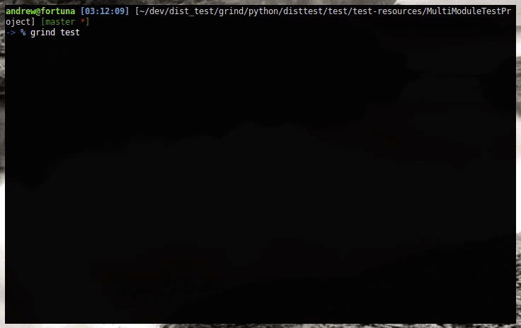
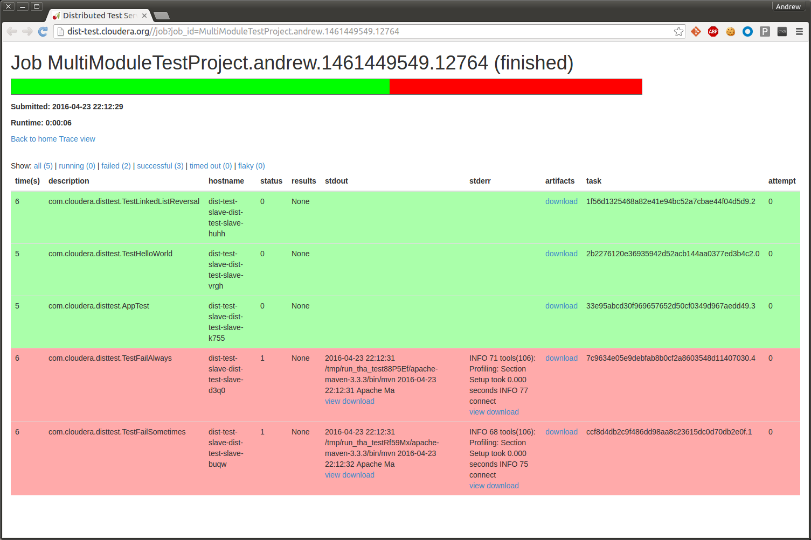
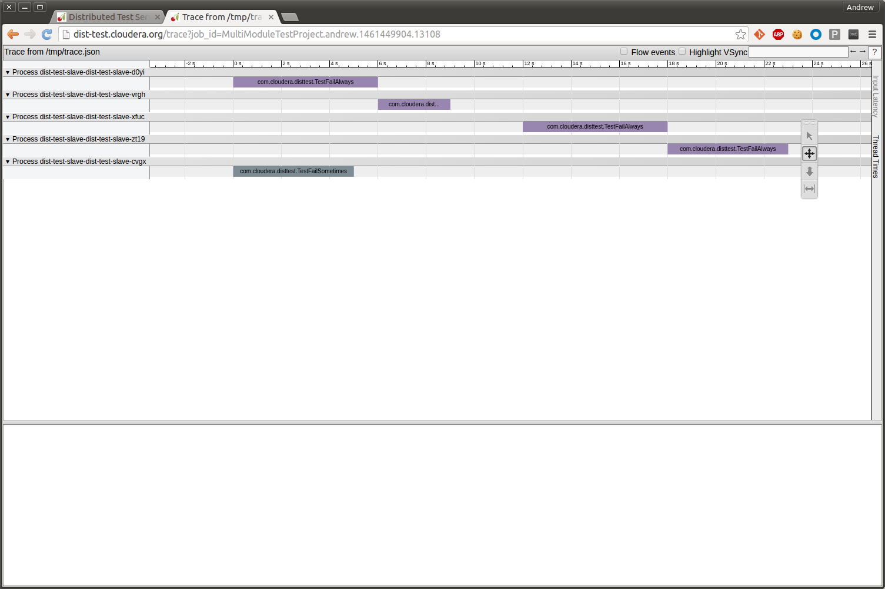

# dist_test

Unit test suites are the first line of defense for finding software bugs.
However, running a project's full unit test suite can take hours or even days!
This means developers are unable to run the unit test suite in all circumstances where it would be desirable, leading to a number of issues:

* Lower software quality, since the latency of running the full suite might make it infeasible as a precommit check.
* Reduced developer productivity, since so much time is spent waiting for unit test runs.
* Longer debugging times, particularly when debugging race conditions or timing issues in a flaky test.
* A resistance to adding additional tests (especially end-to-end and randomized tests), since it further increases the runtime of the test suite.
* Treating the unit test suite as a burden, since it is onerous to run, and typically requires kicking off Jenkins jobs.

Our goal was to write a developer-oriented tool to make running unit tests fast, easy, and accessible.
This means running the full test suite in the time it takes to get a cup of coffee (&lt;10 minutes), and doing it without having to leave the command-line to start the test run, monitor progress, or view the results.
Essentially, the equivalent of `ctest` or `mvn test`, but much faster.

These requirements ruled out just parallel testing.
Our experiences with [Surefire parallel test execution](https://maven.apache.org/surefire/maven-surefire-plugin/examples/fork-options-and-parallel-execution.html) were not positive.
It required extensive refactors of the test suite to avoid shared state like hardcoded temp directories and port numbers.
Furthermore, the degree of parallelism is limited to a single machine, which limits the potential speedup.

For these reasons, we pursued **distributed** testing, and built out our own cloud-based distributed testing infrastructure.

As one example, it takes 8.5 hours to run the 1700+ JUnit test classes in Apache Hadoop serially.
Using our `dist_test` infrastructure, we can run these same tests in about 15 minutes.
This same infrastructure is being used by multiple projects at Cloudera, and has become an invaluable tool in our developers' toolbox.

# Architecture

The distributed testing infrastructure has two components: the backend and the frontend.

The backend is a shared resource, and handles storing test dependencies, running test tasks, and monitoring ongoing test runs.

The frontends are language and test framework dependent.
For instance, we have a frontend for C++ projects using gtest, and also a frontend for Java projects using Surefire and JUnit.
Frontends are responsible for enumerating the set of tests in the project, determining the test dependencies, and packaging up each test as an independent task.

Frontends are also the developer's interface to the test infrastructure, and provide CLI-based ways of monitoring an ongoing test run and fetching test logs and output.

# Backend

`dist_test` reuses some distributed test building blocks developed by Chromium: [Swarming](https://www.chromium.org/developers/testing/isolated-testing/for-swes) and its Go rewrite [Luci](https://github.com/luci/luci-go).
These provide:

* The `.isolate` file format, which specifies the dependencies of a test and how to invoke it
* The isolate server, a content-addressed blobstore for serving test dependencies
* Command-line utilities for interacting with the isolate server and running an "isolated" test.

There are some notable feature gaps here, which compromise the functionality in `dist_test`:

* Generating isolate files for an existing C++ or Java project with unit tests
* A master for submitting test jobs, scheduling test tasks, tracking task state, as well as easy GUI and REST access
* A cluster of slaves for actually running tests
* A command-line client so developers interact with the master and watch job progress
* Integration with existing test result reporting infrastructure, e.g. Jenkins

We also reuse some off-the-shelf software components like [beanstalkd](http://kr.github.io/beanstalkd/) for a work queue and MySQL to persist the master's state.
This means that the master can be restarted without affecting running jobs, making it easy to roll out software updates.
We also use S3 to store the stderr and stdout of failed tests.

# Frontend

We have written two frontends, one for Apache Kudu (C++ and gtest), and one for Java projects using Maven, Surefire, and JUnit.

The gtest frontend is available in the Apache Kudu repository at [build-support/dist-test.py](https://github.com/apache/incubator-kudu/blob/master/build-support/dist_test.py).
This frontend is simple, since each unit test is a statically linked binary without additional dependencies.

`grind` is our Maven/JUnit/Surefire/JUnit frontend, and is substantially more complex.
It is possible to invoke JUnit tests directly, but this is not bulletproof since Surefire tests expect a Maven-like directory layout, as well as environment from the pom files.
Determining all the JAR and resource dependencies to run a test is also difficult, since there is no programmatic access to Maven dependency management.

# Example usage

See the [setup guide](docs/setup) for detailed instructions on setting up dist_test and required services.

Here, let's demonstrate how developers interact with the distributed testing infrastructure, using the `grind` frontend.

`grind` expects to be run from the root of the Maven project.
It exposes an interface broadly similar to `mvn test`.
You can run all tests, specify tests to be included/excluded, as well as more advanced features like running a test multiple times, or automatically retrying a task on failure.

These examples are being run on the example Maven project included with `grind`.

Submitting a job:

Viewing the job status page:

Looking at the "trace" view of the job, a timeline of when tasks were run on which slaves:

# Additional resources

More detailed information about `dist_test` and `grind` can be found in the included project documentation:

* [docs/setup.md](docs/setup.md)
* [docs/dist_test.md](docs/dist_test.md)
* [docs/grind.md](docs/grind.md)
